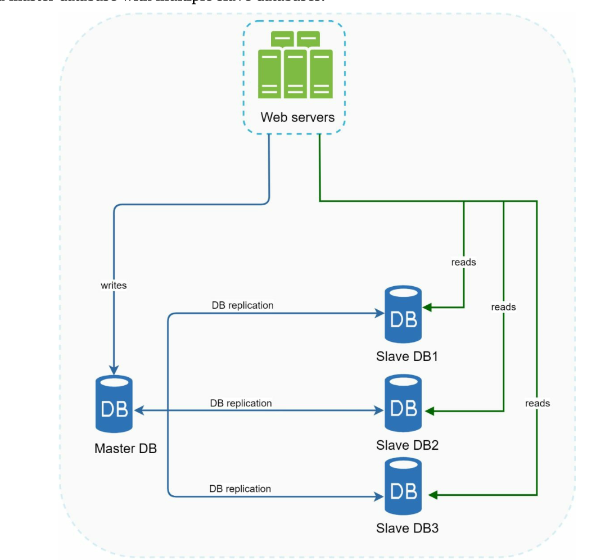

#  System design 

## C1 SCALE FROM ZERO TO MILLIONS OF USERS

### Database
With the growth of the user base, one server is not enough, and we need multiple servers: one for web/mobile traffic, the other for the database (Figure 1-3). Separating web/mobile traffic
(web tier) and database (data tier) servers allows them to be scaled independently.
 

**Which databases to use?** 
The most popular ones are MySQL, Oracle database, PostgreSQL, etc.
- Relational databases represent and store data in tables and rows. You can perform join
operations using SQL across different database tables.

- Non-Relational databases are also called NoSQL databases. Popular ones are CouchDB,
Neo4j, Cassandra, HBase, Amazon DynamoDB, etc. . These databases are grouped into
four categories: key-value stores, graph stores, column stores, and document stores. Join
operations are generally not supported in non-relational databases.

- Non-relational databases might be the right choice if:
1. Your application requires super-low latency.
2. Your data are unstructured, or you do not have any relational data.
3. You only need to serialize and deserialize data (JSON, XML, YAML, etc.).
4. You need to store a massive amount of data.

### Vertical scaling vs horizontal scaling

Vertical scaling, referred to as “scale up”, means the process of adding more power (CPU, RAM, etc.) to your servers
1. Use when traffic is low
2. Has a hard limit
3. No failover and redundancy

Horizontal scaling, referred to as “scale-out”, allows you to scale
by adding more servers into your pool of resources.

###  A load balancer
1. Users will unable to access the website if the web server is offline. In another scenario, if many users access the
2. web server simultaneously and it reaches the web server’s load limit, users generally
experience slower response or fail to connect to the server.

web servers are **unreachable** directly by clients anymore

A private IP is an IP address reachable only
between servers in the **same network**

The load
balancer communicates with web servers through private IPs.

### Database replication

- A master database generally only supports write operations. All the data-modifying
commands like insert, delete, or update must be sent to the master database
- A slave database gets copies of
the data from the master database and only supports read operations.



Advantages of database replication:
- Better performance: In the master-slave model, all writes and updates happen in master
nodes; whereas, read operations are distributed across slave nodes. This model improves
performance because it allows more queries to be processed in parallel.

- Reliability: If one of your database servers is destroyed by a natural disaster, such as a
typhoon or an earthquake, data is still preserved

- High availability: By replicating data across different locations, your website remains in
operation even if a database is offline as you can access data stored in another database
server.

#### Operation
- If only one slave database is available and it goes offline, read operations will be directed
to the master database temporarily

- If the master database goes offline, a slave database will be promoted to be the new
master. All the database operations will be temporarily executed on the new master
database. 
- In production systems, promoting a new master is more complicated as the data in a slave
database might not be up to date.
- The missing data needs to be updated by running data
recovery scripts.


## improve the load/response time

adding a cache layer and shifting static content
(JavaScript/CSS/image/video files) to the content delivery network (CDN).

### Cache

A cache is a temporary storage area that stores the result of expensive responses or frequently
accessed data in memory 

**Cache tier**
The cache tier is a temporary data store layer, much faster than the database. 

- better system performance, 
- ability to reduce database
workloads, 
- the ability to scale the cache tier independently


**read-through cache**
```
on request
if !cache contains response
    queries database
    stores the response in cache

send data back to client
    
```

**Considerations for using cache**

- Decide when to use cache.
  - Consider using cache when data is read frequently but modified infrequently. 
  - cached data is stored in volatile memory, a cache server is not ideal for persisting data 
  - important data should be saved in persistent data stores.
- Expiration policy
  - When there is no expiration policy, cached data will be stored in the memory permanently
  - It is advisable not to make the expiration date too short as this will cause the system to reload data from the database too frequently
  - it is advisable not to make the expiration date toolong as the data can become stale.
- Consistency
  - This involves keeping the data store and the cache in sync
  - Inconsistency can happen because data-modifying operations on the data store and cache are not in a single transaction.
  - When scaling across multiple regions, maintaining consistency between the data store and cache is challengin
- Mitigating failures
  - A single cache server represents a potential single point of failure (SPOF),
  - multiple cache servers across different data centers are recommended to avoid SPOF
  - overprovision the required memory by certain percentages This provides a buffer as the memory usage increases.
- Eviction Policy
  - Once the cache is full, any requests to add items to the cache might cause existing items to be removed.
  - LRU, LFU, FIFO

### Content delivery network (CDN)
A CDN is a network of geographically dispersed servers used to deliver **static content**. CDN servers cache static content like images, videos, CSS, JavaScript files, etc.

**Considerations of using a CDN**

- Cost: 
  - CDNs are run by third-party providers, and you are charged for data transfers in and out of the CDN. 
  - Caching infrequently used assets provides no significant benefits so you should consider moving them out of the CDN.
- Setting 
  - an appropriate cache expiry: For time-sensitive content, setting a cache expiry time is important. 
- CDN fallback: 
  - You should consider how your website/application copes with CDN failure.
- Invalidating files: 
  - You can remove a file from the CDN before it expires by performing one of the following operations:
    - Invalidate the CDN object using APIs provided by CDN vendors.
    - Use object versioning to serve a different version of the object. To version an object, you can add a parameter to the URL, such as a version number


 CDN vs Cache
1. CDNs talk to user interface directly
2. Cache talks to server


### Stateless web tier

**scaling the web tier horizontally**
- we need to move state (for instance user session data) out of the web tier. 
- A good practice is to store session data in the persistent storage such as relational database or NoSQL.
- Each web server in the cluster can access state data from databases. This is called stateless web tier.

### Stateful architecture
A stateful server remembers client data (state) from one request to the next. 

- User can only talk to one sever during the session
- This can be done with sticky sessions in most load balancers
- this adds the overhead
- Adding or removing servers is much more difficult with this approach
- It is also challenging to handle server failures

### Stateless architecture
A stateless server keeps no state information.


- State data is stored in a shared data store and kept out of web servers.
- A stateless system is simpler, more robust, and scalable.


- In Figure 1-14, we move the session data out of the web tier and store them in the persistent data store
  - The NoSQL data store is chosen as it is easy to scale
  - After the state data is removed out of web servers, 
  - auto-scaling of the web tier is easily achieved by adding or removing servers based on traffic load.

### Data centers
- two data centers. In normal operation, users are geoDNS-routed, also known as geo-routed, to the closest data center, with a split traffic of x% in US-East and (100 – x)% in US-West
- geoDNS is a DNS service that allows domain names to be resolved to IP addresses based on the location of a user.


**In the event of any significant data center outage**

- Traffic redirection: 
  - Effective tools are needed to direct traffic to the correct data center. 
  - GeoDNS can be used to direct traffic to the nearest data center depending on where a user is located
- Data synchronization
  - Users from different regions could use different local databases or caches
  - In failover cases, traffic might be routed to a data center where data is unavailable.
  - A common strategy is to replicate data across multiple data centers
- Test and deployment
  - With multi-data center setup, it is important to test your website/application at different locations
  - Automated deployment tools are vital to keep services consistent through all the data centers

To further scale our system, we need to **decouple different components** of the system so they
can be scaled independently
- Messaging queue is a key strategy employed by many real-world distributed systems to solve this problem.

### Message queue

- A message queue is a durable component, stored in memory, that supports asynchronous communication.
- It serves as a buffer and distributes asynchronous requests.
- Input services, called producers/publishers, create messages, and publish them to a message queue.
- Input services, called producers/publishers, create messages, and publish them to a message queue.
- Decoupling makes the message queue a preferred architecture for building a scalable and reliable application.
- With the message queue, the producer can post a message to the queue when the consumer is unavailable to process it. 
- The consumer can read messages from the queue even when the producer is unavailable. 


### Logging, metrics, automation

- Logging: 
  - Monitoring error logs is important because it helps to identify errors and problems in the system. 
  - You can monitor error logs at per server level or use tools to aggregate them to a centralized service for easy search and viewing.
- Metrics: 
  - Collecting different types of metrics help us to gain business insights and understand the health status of the system
    - Host level metrics: CPU, Memory, disk I/O, etc.
    - Aggregated level metrics: for example, the performance of the entire database tier, cache tier, etc.
    - Key business metrics: daily active users, retention, revenue, etc.
- Automation
  - need to build or leverage automation tools to improve productivity
  - Continuous integration is a good practice, in which each code check-in is verified through automation, allowing teams to detect problems early
  - automating your build, test, deploy process, etc. could improve developer productivity significantly.


### Database scaling

**Vertical scaling**
- The overall cost of vertical scaling is high. Powerful servers are much more expensive.

**Horizontal scaling**
AKA **sharding**
Sharding separates large databases into smaller, more easily managed parts called shards.

Feels like hash

User data is allocated to a database server based on user IDs. Anytime you access data, a hash function is used to find the corresponding shard. In our example, user id % 4 is used as the hash function.

The most important factor to consider when implementing a sharding strategy is **the choice of the sharding key**

- Resharding data when
  - a single shard could no longer hold more data due to rapid growth.
  - Certain shards might experience shard exhaustion faster than others due to uneven data distribution
- Celebrity problem, aka hotspot key problem
  - we may need to allocate a shard for each celebrity. Each shard might even require further partition.
- Join and de-normalization
  - it is hard to perform join operations across database shards
  - A common workaround is to de-normalize the database so that queries can be performed in a single table.

### Millions of users and beyond
- Keep web tier stateless
- Build redundancy at every tier
- Cache data as much as you can
- Support multiple data centers
- Host static assets in CDN
- Scale your data tier by sharding
- Split tiers into individual services
- Monitor your system and use automation tools

## BACK-OF-THE-ENVELOPE ESTIMATION

### Power of 2

Latency numbers every programmer should know


- Memory is fast but the disk is slow.
- Avoid disk seeks if possible.
- Simple compression algorithms are fast.
- Compress data before sending it over the internet if possible.
- Data centers are usually in different regions, and it takes time to send data between them.

### Availability numbers

## A FRAMEWORK FOR SYSTEM DESIGN INTERVIEWS

- A good interviewer also looks for red flags.
- Over-engineering is a real disease of many
  engineers as they delight in design purity and ignore tradeoffs

### A 4-step process for effective system design interview

- Step 1 - Understand the problem and establish design scope
  - **Answering without a thorough understanding of the requirements** is a huge red flag as the interview is not a trivia contest
  - ask the right questions
  - make the proper assumptions
  - gather all the information needed to build a system
  - answers your question directly or asks you to make your assumptions
  - If the latter happens, write down your assumptions on the whiteboard or paper.
  - Sample questions
    - What specific features are we going to build?
    - How many users does the product have?
    - How fast does the company anticipate to scale up? What are the anticipated scales in 3 months, 6 months, and a year?
    - What is the company’s technology stack What existing services you might leverage to simplify the design?
    - Is this a mobile app? Or a web app? Or both?
    - What are the most important features for the product?
- Step 2 - Propose high-level design and get buy-in
  -  It is a great idea to collaborate with the interviewer during the process.
     -  Come up with an initial blueprint for the design
     -  Draw box diagrams with key components on the whiteboard or paper.
        -  clients
        -  APIs, 
        -  web servers,
        -  data stores, 
        -  cache, 
        -  CDN, 
        -  message queue, 
        -  etc.
  -  Do back-of-the-envelope calculations to evaluate if your blueprint fits the scale constraints
  -  If possible, go through a few concrete use cases.
  -  API endpoints and database schema here?
     -  This depends on the problem.
- Step 3 - Design deep dive
   - At this step, you and your interviewer should have already achieved the following objectives:
      - Agreed on the overall goals and feature scope
      - ketched out a high-level blueprint for the overall design
      - Obtained feedback from your interviewer on the high-level design
      - Had some initial ideas about areas to focus on in deep dive based on her feedback
    - identify and prioritize components in the architecture
      - on the system performance characteristics
        - likely focusing on the bottlenecks and resource estimations
      - focusing on high-level design
      - dig into details of some system components
    - Time management is essential
      - armed with signals to show your interviewe
      - Try not to get into unnecessary details.
- Step 4 - Wrap up
  - a few directions to follow
    - identify the system bottlenecks and discuss potential improvements
      - Never say your design is perfect and nothing can be improved
    - useful to give the interviewer a recap of your design
      - important if you suggested a few solutions
    - Error cases (server failure, network loss, etc.)
    - Operation issues are worth mentioning. How do you monitor metrics and error logs? How to roll out the system? Testing?
    - How to handle the next scale curve is also an interesting topic
    - Propose other refinements you need if you had more time.
 
**Dos**
- Always ask for clarification.
- Understand the requirements of the problem.
- There is neither the right answer nor the best answer. 
- Let the interviewer know what you are thinking
- Suggest multiple approaches if possible.
  - pros and cons
- Once you agree with your interviewer on the blueprint
  - go into details on each component. 
  - Design the most critical components first.
- Bounce ideas off the interviewer.
- Never give up.

**Dont**
- Don't be unprepared for typical interview questions.
- Don’t jump into a solution without clarifying the requirements and assumptions.
- Don’t go into too much detail on a single component in the beginning. Give the high-level design first then drills down.
- If you get stuck, don't hesitate to ask for hints.
- Don't think in silence
- Don’t think your interview is done once you give the design. You are not done until your interviewer says you are done. Ask for feedback early and often.

**Time allocation on each step**
  - Step 1 Understand the problem and establish design scope: 3 - 10 minutes
  - Step 2 Propose high-level design and get buy-in: 10 - 15 minutes
  - Step 3 Design deep dive: 10 - 25 minutes
  - Step 4 Wrap: 3 - 5 minutes

## CHAPTER 4: DESIGN A RATE LIMITER

Sample:
- A user can write no more than 2 posts per second.
- You can create a maximum of 10 accounts per day from the same IP address.
- You can claim rewards no more than 5 times per week from the same device.

benefits: 
- Prevent resource starvation caused by Denial of Service (DoS) attack.
- Reduce cost
- Prevent servers from being overloaded.

### Step 1 - Understand the problem and establish design scope
- client-side rate limiter or server-side API rate limiter
- Does the rate limiter throttle API requests based on IP, the user ID, or other properties?
- What is the scale of the system? Is it built for a startup or a big company with a
large user base?
- Will the system work in a distributed environment?
- Is the rate limiter a separate service or should it be implemented in application code?
- Do we need to inform users who are throttled?

Think about 
- accuracy
- latency
- memory
- distributed
- exception
- fault tolerance

### Propose high-level design and get buy-in
- Client-side
  - unreliable place to enforce rate limiting because client requests can easily be forged by malicious actors.
- Server-side implementation


Cloud microservices [4] have become widely popular and rate limiting is usually
implemented within a component called **API gateway**.

API gateway is a fully managed
service that supports 
- rate limiting, 
- SSL termination, 
- authentication, 
- IP whitelisting, 
- servicing static content,
- etc. 

where should the rater limiter be implemented, on the server-side or in a gateway? 
-  current technology stack
-  rate limiting algorithm
-  Building your own rate limiting service takes time
  
**Algorithms for rate limiting**
- Token bucket


  - Bucket size
    - have different buckets for different API endpoints
    - throttle requests based on IP addresses, each IP address requires a bucket.
    - If the system allows a maximum of 10,000 requests per second, it makes sense to have a global bucket shared by all requests.
  - Refill rate
  - Pros
    - easy to impl
    - memory efficient,
    - allows burst of traffic for short periods
  - Cons
    -  it might be challenging to tune bucke size and refill rate.
- Leaking bucket
  - similar to the token bucket except that requests are processed at a fixed rate
  - usually implemented with a first-in-first-out (FIFO) queue
  - two parameters
    - Bucket size: it is equal to the queue size. The queue holds the requests to be processed at a fixed rate.
    - Outflow rate: it defines how many requests can be processed at a fixed rate, usually in seconds.
  - Pros:
    - Memory efficient given the limited queue size.
    - suitable for stable outflow rate is needed
  - Cons:
    - cannot handled the burst traffic
    - Not easy to tune


- Fixed window counter
  - How:
    - divides the timeline into fix-sized time windows and assign a counter for each window.
    - Each request increments the counter by one
    - Once the counter reaches the pre-defined threshold, new requests are dropped until a new time window starts.
  - Pros:
    - Memory efficient.
    - Easy to understand.
    - Resetting available quota at the end of a unit time window fits certain use cases.
  - Cons
    -  Spike in traffic at the edges of a window could cause more requests than the allowed quota to go through.
- Sliding window log
  - The algorithm keeps track of request timestamps. Timestamp data is usually kept in. cache, such as sorted sets of Redis
  - When a new request comes in, remove all the outdated timestamps.
  - Add timestamp of the new request to the log.
  - If the log size is the same or lower than the allowed count, a request is accepted Otherwise, it is rejected.
  - Pro: accurte
  - Cons: consumes a lot memeory
- Sliding window counter
  - hybrid approach that combines the fixed window counter and sliding window log. 
  - Pros: memory efficient & handle spikes
  - Cons:  It only works for not-so-strict look back window. It is an approximation of the actual rate because it assumes requests in the previous window are evenly distributed.

- Hard vs soft rate limiting
  - Hard: The number of requests cannot exceed the threshold.
  - Soft: Requests can exceed the threshold for a short period.

- Rate limiting at different levels.
  - application level 
  - rate limiting by IP addresses using Iptables

- Avoid being rate limited
  - Use client cache to avoid making frequent API calls.
  - Understand the limit and do not send too many requests in a short time frame.
  - Include code to catch exceptions or errors so your client can gracefully recover from exceptions.
  - Add sufficient back off time to retry logic.

**High-level architecture**
- Using the database is not a good idea due to slowness of disk access.
-  In-memory cache is chosen because it is fast and supports time-based expiration strategy
   -  Redis is a popular option, offers 2 command INCR and EXPIRE.


### Design deep dive

Follow 2 are missed from fig 4-12
- How are rate limiting rules created? Where are the rules stored?
- How to handle requests that are rate limited?


**Rule**

```
domain: messaging
descriptors:
- key: message_type
  Value: marketing
  rate_limit:
    unit: day
    requests_pe_unit: 5
```

- Rules are generally written in configuration files and saved on disk.

**Exceeding the rate limit**
- APIs return a HTTP response code 429 (too many requests)
- we may enqueue the rate-limited requests to be processed later

**Rate limiter headers**
- How does a client know whether it is being throttled? 
- how does a client know the number of allowed remaining requests before being throttled

Use header
- X-Ratelimit-Remaining: The remaining number of allowed requests within the window.
- X-Ratelimit-Limit: It indicates how many calls the client can make per time window.
- X-Ratelimit-Retry-After: The number of seconds to wait until you can make a request again without being throttled.


**Detailed design**


- Rules in disk
- Workrers pull rules from disk
- rule stored in cache
- Rate limiter middlewar(RLM) loads rules from cache
- rlm fetch the counter from redis
- rlm decided

**Rate limiter in a distributed environment**

- Challenge
  - Race condition
    - Use lock but it will slow down the system
    - Lua scrip and sorted sets data structure in redis
  - Synchronization issue
    - large system might needs more than one Rate limiter
    - One possible solution is to use sticky sessions that allow a client to send traffic to the same rate limiter. 
      - this is not scalable or flexible
    - Or use centralized data store

**Performance optimization**

2 areas to improve
- multi-data center setup is crucial for a rate limiter sicne latency is high for user far away from the data center
- synchronize data with an eventual consistency model

**Monitoring**

- make sure algorithm and rules are effective

### Step 4 - Wrap up

## CHAPTER 5: DESIGN CONSISTENT HASHING

- achieve horizontal scaling
- important to distribute requests/data efficiently
- Consistent hashing is a commonly used technique to achieve dthis goal

<!-- TODO: finish ch5 -->

## CHAPTER 6: DESIGN A KEY-VALUE STORE

- A key-value store
- a non-relational database

## CHAPTER 14: DESIGN YOUTUBE

- The solution to this question can be applied to other interview questions like designing a video sharing platform such as Netflix and Hulu.
- Total number of monthly active users: **2 billion**.
- Number of videos watched per day: **5 billion**.
- 73% of US adults use YouTube
- 50 million creators on YouTube
- YouTube’s Ad revenue was $15.1 billion for the full year 2019, up 36% from 2018
- responsible for 37% of all mobile internet traffic.
- available in 80 different languages.

### Step 1 - Understand the problem and establish design scope

Question:
- What features are important?
  - Ability to upload a video and watch a video
- What clients do we need to support?
  - Mobile apps, web browsers, and smart TV.
- How many daily active users do we have?
  - 5 million
- What is the average daily time spent on the product?
  - 30min
- Do we need to support international users?
  - Yes, a large percentage of users are international users.
- What are the supported video resolutions?
  - The system accepts most of the video resolutions and formats.
- Is encryption required?
  - Yes
- Any file size requirement for videos?
  - Our platform focuses on small and medium-sized videos. The maximum allowed video size is 1GB.
- Can we leverage some of the existing cloud infrastructures provided by Amazon, Google, or Microsoft?
  - That is a great question. Building everything from scratch is unrealistic for most companies, it is recommended to leverage some of the existing cloud services.

**Focus**
- Ability to upload videos fast
- Smooth video streaming
- Ability to change video quality
- Low infrastructure cost
- High availability, scalability, and reliability requirements
- Clients supported: mobile apps, web browser, and smart TV

**Back of the envelope estimation**

- 5m DAU
- 5 video per user per day
- 10% user upload 1 video per day
- avg video size is 300mb
- daily storage needed: 5m * 10% * 300mb =10^5 * 1500mb = 150 * 10^6mb =150Tb
- CDN cost
  - amazon cdn in use cost $0.02/gb
  - daily cost is 5m * 5 * 0.3 * 0.02 = $15 * 10^4  
  
### Step 2 - Propose high-level design and get buy-in


- Client: pc, mobile, tv, vr
- CDN: video stored in CDN
- API servers: 
  - recoomendation
  - video upload
  - meta data database
  - cache
  - signup
  - Video uploading
  - Video stream flow

**Video uploading flow**


- user watch on devices
- load balancer: distrubte requests
- api servers: everything but video stream
- metadata db: video metadata, shared and replicated for performance and high availablelity
- metadata cache: for better performance
- original storage: a blob (a binary large object) storage
- transcodeding servers: video transcoding to format better for streams depends on bandwidth or cap
- transcode storage: blob storage for transcoded video
- CDN where the videos are cached
- Completion queueu: store video transcoding completion events
- Completino handler: list of workders that pull event data 

**Flow a: upload the actual video**

1. video upload to original
2. transcoding server fetch the video from original storage and transcoding
3. parallel steps
   1. transcoded video send to transcoded storage, then distributed to CDN 
   2. transcoding completion event queued in completion queue, then workers start to pull data from the queue. Completion handler update the meta data database and cache when video transcoding is complete
4. API server inform the client the completion

**Flow b: upload the metadata**

The request contains video metadata,
including 
- file name
- size,
- format, 
- etc. 

API servers update the metadata cache and database.


**Video streaming flow**
Streaming means your device continuously receives video streams from remote source videos.
Popular streaming protocols are:
- MPEG–DASH. MPEG stands for “Moving Picture Experts Group” and DASH stands for "Dynamic Adaptive Streaming over HTTP"
- Apple HLS. HLS stands for “HTTP Live Streaming”
- Microsoft Smooth Streaming.
- Adobe HTTP Dynamic Streaming (HDS).

### Step 3 - Design deep dive
**video uploading flow**
- Why Video transcoding
  - raw video is big
  - device support
  - high-quality whiule smooth playback
  - Adapt to network condition
- Encoding formats, mosto of them contains 2 parts
  - Container: a baskets tha contains video/audio and meta data.
  - Codecs: compression and decompression algorithms like H.264, VP9d
**video streaming flow**

- Transcoding a video is computationally expensive and time-consuming
- DAG: To support different video processing pipelines and maintain high parallelism


## design tiktok
### requirement
**Functional**
- upload video
- watch video

**non-functional**
- scalability
- availablity
- video latency
- fault tolance

**assumption**
- 1B DAU
- watch 100/day
- upload 1/day
- avg 1 min video -> 10MB
- length of video 15s - 3min

**Basic for everything**


**Scale for function**


**To scalale up**
- more data partition
- more functional partition
- more copy

**Add metaData for video**


**Deep dive for metaData**
- SQL vs NonSql
  - Sql
    - ralation, bunnessis is already there
    - need to handle data sharding
  - non sql
    - data sharding is handled already
    - cheap
    - no business searching
- whatever is in use

**Deep dive for storage**
- Blob vs FS
  - FS
    - Pro:
      - hard to lost the files
      - a lot of chunk for data
      - clasic 3 numnber of replica
    - Con:
      - it's slow
      - a lot of space
  - Blob
    - Pro:
      - a lot of small files

### Deep dive for upload

- Simple solution
  - Just upload as one file
    - Pro: simple
    - Con: 
      - risk of upload 1 big file
      - too late to detect the invalid video
        - copy right
      - expose the storage
- Updated solution
  - temp raw space


1min -> 10Mb
60s * 30 fps * (720 * 480 * 3 * 8 bytes ) = 1800 m/s

**Upload video alg**
- video compress
  - split video to small chunk
    - 10Mb to 10 * 1Mb
    - syntax, split the video by moving bits
  - in mobile env, the connection is not stable
    - split vide to small chunk helps failure tolance
    - paralle upload

**video processing**
- add a message queue to process the status of the upload


- add a worker queue to process the message queue
- Adjust the worker number depends on the api call


**video encoding for woker**

- encoding the video for different device
  - the video get uploaded is different fromt the video get played 
  - the video for play changes depends on
    - quality of the connection
    - power of the device


**State machine**
Start -> ready -> process -> done
           |         |
           - ---> retry
### Deep dive for upload


**Basic**
1. view api query metadata
2. view api query blob storage

**Hotspot**
- for popular video
  - Add cdn
    - 
    - More cost
  - Move popular video to CDN
    - 
    - more cost
**Stream protocal**
- apple's protocal
- different device have different protocal

**Show off**
- Use machine learning to improve what video to view feed

- localization 
  - different data center

## design yelp / point of interest

Indexing or retrival problem
- modeling

Caching problem
- for query

Same:
1. store a lot of data
2. return the data quickly
3. High concurrency
4. low requirement for write data

Different:
- core for caching is hit & missing ratio

### requirement
**Functional**
- search nearby location
- watch view shop details
- owner add/update/delete shop

**non-functional**
- low latency
- freshness -daily/hourly
- scalable
- FT

**assumption**
- 1B Monthly AU
- 500M DAU
- 200M shops

### Technical

#### Storage
- SQL vs NonSql vs in memory
  - Sql
    - ralation, bunnessis is already there
    - need to handle data sharding
  - non sql
    - data sharding is handled already
    - cheap
    - no business searching
- whatever is in use

**Data model**
- id: int
- owner id: int
- location: double
- address: string
- city: string
- state: string
- contry: string
- zip: long
- description: string: 5kb
- picture/video as url: string
-> 10kb

200M * 10kb = 2TB -> not worthy for in memory

**Basic for everything**


**Calculation**
- search
  - 500M * 5/day = 2500M/100k sec = 25k QPS
  - peak 100k QPS
  - 20 shards
  - auto scalaing 
- Business owner 
  - 200M * 1 upd - 10ate/month = 200M/(30*100k) = 70 qps
  - no need to worries, can handle on single machine

Conclusion: focus on search

#### Deep dive on search**
- master + slave
- database sharding
  - which id to shard
  - some maintaince cost

API:


**solutions for sql**
There are 2 paras
1. write a query for the whole table 
2. 联合索引？
  - 最左匹配，无法优化
3. geo hash
   1. 2d to 1d -> 字母+数字
   2. stored as data in data base
4. quatar tree
   1. stored as structure in RAM
   2. how to fit into memory
   3. tree structure store info on leaf
   4. what to store
      1. business id
      2. lat/long
      3. short desc
      4. < 50 byte
      5. (200M/100(per node)) * (100*50B) -> 10G
      6. can be store in ram
   5. hard to update the tree
      1. what if the new node is on the boarder
   6. relax the refresh rate
      1. daily or hourly, not much cost increase
   7. 
      1. add seed for fault tolance, on serice crash, build the tree from seed
   8. break down the quad tree from global to deployment (west/east/centra us). it's too much by city.
      1. more cost
      2. helps on FT
      3. reduce the size of tree
5. Improve the search with cache
   1. 
   2. the more cache is closer to the front end, the better the performance, but the cost is higher

## Design job schduler 

### requirement 
1. internal system
2. mvp? 
   1. scope
3. type of job
   1. 常驻
   2. 临时
   3. can be all type

**functional**
from user point of view
- user submit task (short term scrip or long term task)
- visulazation/monitor
- advanced feature
  - add future task
  - DAG (job dependency, directed acyclie graph)

**non functional**
1. laytency 
   1. submit takes less than 10s
   2. dashboard  fresh per 60s
2. scalablilty
3. relaibility

**job data model**
1. repo (code/config/exec)
2. metadata
   1. id
   2. owner id
   3. binary path
   4. in/output path
   5. created time
   6. status
      1. ready -> waiting -> exec -> success
                      |        |
                      retry-- fail -> abort      
   7. retry_count

**Basic**


**Improved**
- add cache
- add queue


- dashboard qps
  - 10k user * 100 job/user/day * 10 view = 100 qps
  - Peak = 500 qps

- submission qps 
  - 10k user * 100 job/user/day = 10 qps

**Deep dive for database**
- single point faiure
- double master for reliability

No sql vs sql?
- defer decision, not a blocker
- data model -> foreign key
- query pattern -> do you need union table
- consistency, do I need strong consistency or just eventual consistency
- 开闭原则
  - 好的架构会增加未作出决策的数量

**Deep dive for decoupule**

- message queue 削峰填谷
  - queue might crash
  - no data in queue, can we use one data system
  - message queue as data store
    - kafeka data base
  - data base as message queue
    - higher accecptance
    - google spanner
- fire and forget
  - not safe
  - worker might be dead
- informer - worker
  - check the status of worker 
  - manages the worker
  - rpc
- model
  - pull
  - push
  - hybrid
    - side kick to monitor the work and report the status to informer
    - Add cost the worker
      - might not have enough resource
      - reduce the frequence or time
- save resource
  - on runtime
    - move the vm to container
      - container expose more stuff
    - lightern the vm
  - IO 密集
  - machine 密集
  - 混合部署
    - both IO and machine 密集
    - reallocate resource
  - recycle resource
    - worker might request more resource
    - long term vs temp task
    - cpu is 可压缩资源

**more feature**

- Cron service
  - priority queue to manages the task
  - timed task
  - tasks have prioirty
- DAG service
  - manages the depencency
  - might be able to move to informer
    - might make informer too complicated
    - if split, the system is more extendable


## desigh file system

### requirements
#### functional 
- upload/download files
- sync files across devices
- handle conflicts
#### non functional
- low latency -> 20s
- availibility >> consistency
- reliablity
- scalablilty
  - large file

### basic design


**metadata**
- file id
- owner id
- media type
- created timestamp
- modified timestamp
- permission
- access url
- status
- version 
**metadata storage**

sql vs no sql

- dau: 100M user -> dau 20%
- QPS = 20M * 10 file/day * 200M request / 100k sec = 2k qps
- peak qps: 10k
- both sql and nosql can handle
- no need for strong consistency, just eventual consistency, so use nosql

### deep dive

**reduce upload path**
- split file to 1Mb
  - chunk structure
    - chunk_id
    - file_id
    - status
    - url
    - md5
    - version
    - create timestamp
    - ...
- compress the file
  - txt can reduce a lot space
  - not too much for audio and video
- support paralla upload
- pre-signature 
  - verify the file
  - upload the file from client to blob directly
  - save the upload from file management tot blob storage
- introduce alg to verify file consistency
- don't trust the client info


**update**
- fully sync vs delta sync
  - as chunk is used, just use delta sync
  - append
  - update chunk  
- delete
  - mark file with new status delete but don't delete right away
    - delete it later
- Pull the version data then sync if delta
  - pull is data consuming
  - long pulling, more expensive
  - web socket
    - doesn't work for old browser
- push model
  - sse
  - save time 
  - use http
  - adaptbility is even lower

**conflict**
offline update
- use chunk version
- keep both 
- first writer win
  - use version number which is on top of timestamp
- merge

**revert**
Add log sequcnec

- full sync to avoid missing info
- increase complexity
- moneytization 


